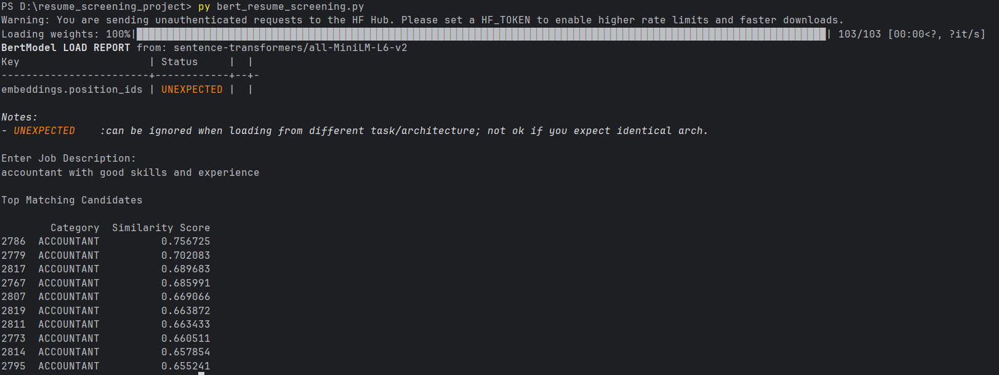
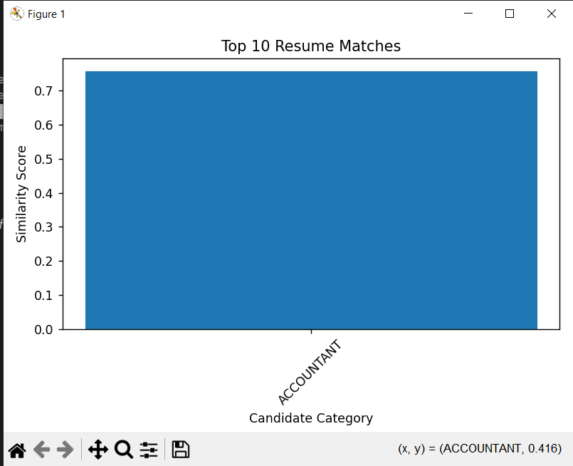

 # Intelligent Resume Screening System Using BERT-Based Semantic Matching

## Project Overview

The **Intelligent Resume Screening System** is a Natural Language Processing (NLP) based project that automates the process of matching candidate resumes with job descriptions. The system uses a **BERT-based semantic embedding model** to understand the contextual meaning of resumes and job requirements.

Instead of traditional keyword-based filtering, this system applies **semantic similarity using BERT embeddings** to identify the most relevant candidates. The system ranks resumes based on similarity scores and visualizes the top matches using graphical charts.

This approach helps recruiters **save time, improve hiring efficiency, and reduce manual screening effort.**

---

# Key Features

- Automated resume screening  
- Semantic matching using BERT embeddings  
- Cosine similarity for candidate ranking  
- Handles large resume datasets  
- Visualization of top matching candidates  
- Simple command-line execution  
- Easy to extend into a web-based system  

---

# System Architecture

The system follows the below processing pipeline:

```
Resume Dataset
       │
       ▼
Text Preprocessing
       │
       ▼
BERT Embedding Generation
       │
       ▼
Similarity Computation
       │
       ▼
Candidate Ranking
       │
       ▼
Visualization
```

---

# Technologies Used

| Technology | Purpose |
|------------|---------|
| Python | Core programming language |
| Pandas | Dataset handling |
| SentenceTransformers | BERT embedding generation |
| Scikit-learn | Cosine similarity computation |
| Matplotlib | Visualization |
| Regular Expressions | Text preprocessing |

---

# Project Structure

```
resume_screening_project
│
├── Resume.csv
├── bert_resume_screening.py
└── README.md
```

---

# Dataset

The project uses the **Resume Dataset available on Kaggle.**

Dataset link:  
https://www.kaggle.com/datasets/snehaanbhawal/resume-dataset

The dataset contains resumes categorized into different job domains.
Each resume contains textual information used for semantic analysis.

---

# Installation

Clone the repository

```bash
git clone https://github.com/yourusername/resume-screening-bert.git
```

Navigate to the project folder

```bash
cd resume-screening-bert
```

Install required libraries

```bash
pip install pandas sentence-transformers scikit-learn matplotlib
```

---

# How to Run the Project

Run the Python script:

```bash
python bert_resume_screening.py
```

Enter a job description when prompted.

Example:

```
Machine learning engineer with Python and deep learning experience
```

The system will:

- Process resumes  
- Generate BERT embeddings  
- Compute similarity scores  
- Rank candidates  
- Display the top matches  
- Generate a visualization chart  

---

## Project Output





A **bar graph visualization** will also appear showing the similarity scores of the top candidates.

---

# Methodology

The system consists of the following steps:

## 1. Resume Dataset Collection
A publicly available resume dataset is used for candidate information.

## 2. Text Preprocessing

Text is cleaned using:

- Lowercasing  
- Removing special characters  
- Removing URLs  
- Whitespace normalization  

## 3. BERT Embedding Generation

The **SentenceTransformer BERT model** converts resumes and job descriptions into numerical vectors.

## 4. Similarity Computation

Cosine similarity is calculated between job description embeddings and resume embeddings.

## 5. Candidate Ranking

Resumes are ranked based on similarity scores.

## 6. Visualization

Top matching candidates are displayed using a **bar chart**.

---

# Advantages

- Captures contextual meaning using BERT  
- More accurate than keyword-based systems  
- Reduces recruiter workload  
- Provides interpretable visual outputs  
- Scalable for large datasets  

---

# Future Improvements

- Web-based recruitment dashboard  
- Integration with Applicant Tracking Systems (ATS)  
- Automatic skill extraction  
- Resume classification models  
- Deep learning ranking systems  
- Multi-job description matching  

---

# Applications

- Automated recruitment systems  
- HR candidate filtering  
- Talent acquisition platforms  
- Resume recommendation engines  

---

# Research Contribution

This project demonstrates how **transformer-based language models can improve resume screening** by understanding semantic relationships between resumes and job descriptions, leading to better candidate recommendations.

---

# Author

**Seethalaxmi V**  
B.Sc Computer Science Graduate  
Project: *Intelligent Resume Screening System Using BERT-Based Semantic Matching*
